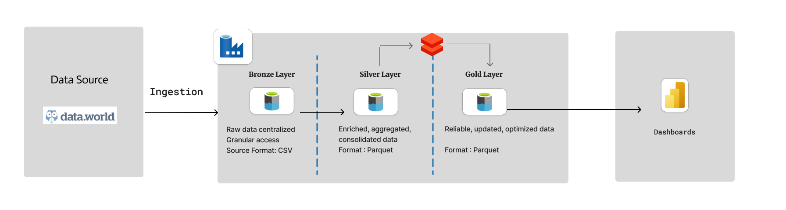

# E-Commerce Data Engineering Project
This project demonstrates the management, streamlining, and analysis of e-commerce data using Azure and Databricks, following the Medallion Architecture. This architecture organizes data processing into three layers—Bronze, Silver, and Gold—to ensure that data is processed in stages, from raw ingestion to cleaned and enriched, then finally to analytics-ready data.

## Project Goals 💡
1. Data Ingestion
- **Build a robust ingestion pipeline to extract data from various sources into a centralized data lake.( ⚙ Azure Data Factory for orchestration, connecting to sources like on-premises databases, cloud storage, or APIs.)**
- **Azure Data Factory for orchestration, connecting to sources like on-premises databases, cloud storage, or APIs.**
2. ETL System (Extract, Transform, Load)
- **Transform raw data into Parquet format, ensuring quality, consistency, and readiness for analysis.(⚙Azure Databricks with Apache Spark for data processing and transformations.)**
- **Data from the Bronze layer is processed in Azure Databricks, where necessary transformations are applied. The transformed data is moved to the Silver layer (cleaned and enriched data) and then to the Gold layer (aggregated, business-ready data) within the data lake. **
3. Store Data
- **Store the transformed data efficiently for long-term storage and high-performance querying.(⚙ Azure Data Lake Storage and Delta Lake.)**
- **Data is stored in Delta Tables in Azure Data Lake, ensuring scalability, reliability, and ACID(atomicity consistency isolation durability)compliance. The Bronze, Silver, and Gold layers are used to manage the different stages of data processing.**
4. Reporting
- **Build interactive dashboards to provide insights and answer key business questions.(⚙ Power BI for data visualization and reporting.)**
- **Power BI connects to the Delta Tables in the Gold layer, creating dashboards and reports.**
## Dataset Used 📤
- **The dataset used is a free e-commerce dataset from data.world.**

[Source: E-commerce users of a French C2C fashion store dataset on data.world](https://data.world/jfreex/e-commerce-users-of-a-french-c2c-fashion-store)

## Architecture Diagram

## Getting Started
- **To set up this project on your Azure environment, follow these steps:**

- **Create Azure Resources: Set up Data Lake, Data Factory, and Databricks.**
- **Ingest Data: Use Data Factory to pull in data into the Bronze layer.**
- **Transform Data: Transform the files to parquet format, store them in Silver. Then, process the data in Databricks and store it in Gold layer.**
- **Visualize: Connect Power BI to the Gold layer and create dashboards.**
## Requirements
- **Azure Subscription with Data Factory, Data Lake, and Databricks.**
- **Power BI Desktop for building dashboards.**

- **This project showcases an end-to-end data engineering pipeline using Azure and Power BI, following the Medallion Architecture for efficient data processing.**
